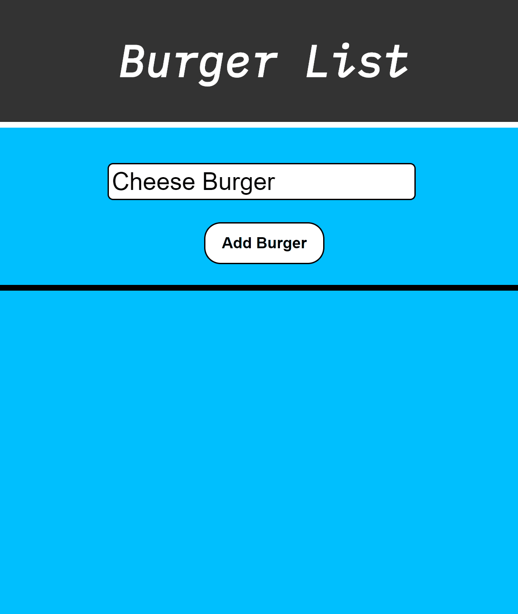

# Burger App!

## What This App Does:

This app will allow the user to see what burgers are currently stored on the online menu, whether those burgers have been devoured or not, add burgers to the list, and delete burgers they do not want to be on the menu any more.

## Technoligies Used:

This is a Node.js App which is dependant upon Express, Express-Handlebars, MySql, JawsDB.

### How This App Works:

This app utilizes the MVC architectural pattern to relate information between the server and the browser. The user will send some type of information transaction (GET: see the burgers on the menu, POST: add a burger to the menu, PUT: changed whether a burger has been devoured or not, DELETE: remove a burger from the menu). That interaction is then process through a controller which handles the server routes. Along the way to the Object-Relational Mapper (ORM), the interaction is passed through the model which will add to the request the table name of the database. The ORM takes this request and sends it up to the database. The result of that action is sent along to the browser using handlebar-templates to display the page to the user. 

## Screenshot:

